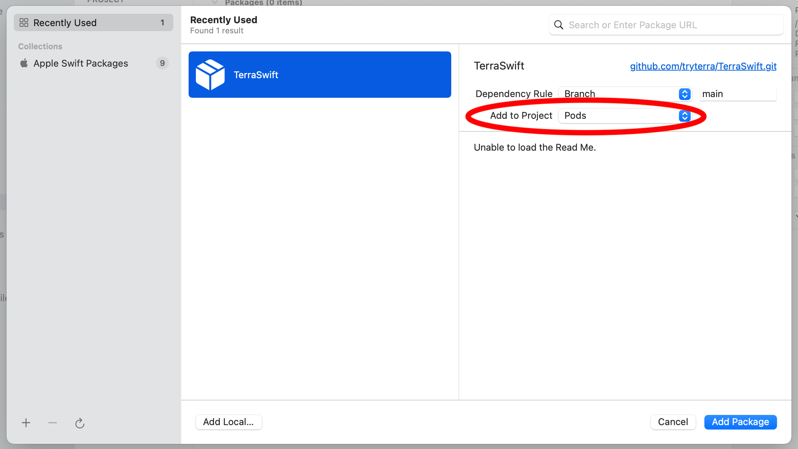
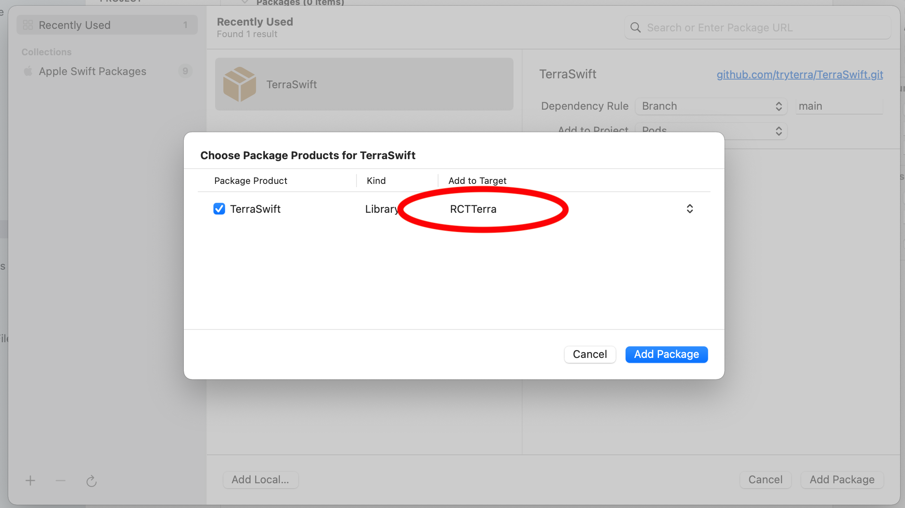

# Terra React Native Apple Healthkit

This package bundles a bridge and an interface to interact with Terra's Apple SDK. This enables developers to build a react native application and connect user's Apple Healthkit to the Terra ecosystem.

## Setup

First, install the NPM package:

```sh
npm install react-native-terra-apple
```

Then install the pod:

```sh
cd ios && pod install && cd ..
```

In the future, we will be supporting a pod installation of the Swift framework. For now, it has to be manually linked to the pod you just installed. Open the pod project in xcode (it should be named `{PROJECT_NAME}.xcworkspace`), and select `Add packages` to add `github.com/tryterra/TerraSwift.git`. Make sure you add it to Pods, and you select the `RCTTerra` pod as a target.




## Usage

You can refer to `/example` for an example usage. First import:

```javascript
import TerraApple from "react-native-terra-apple";
```

After exposing a widget session to your users, if you determine they'd like to authenticate with apple health, you can call `TerraApple.auth` which authenticates the user with Terra and returns a promise:

```javascript
TerraApple.auth("devid", "apikey", "referenceID").then((TerraAuthResponse) => {
  // grab refID, userID, or status from the response
});
```

Once you have a user ID, you can connect the device SDK instance to Terra by using `TerraApple.initTerra`:

```javascript
TerraApple.initTerra("devID", "apiKey", "userID", (autoFetch = true));
```

`initTerra` connects the device to Terra. This has to be done everytime the user opens the app (if the SDK is not initialised it has not indication about where to connect to Terra). On the other hand, the `auth` is only required on the first user connection from your app to map their device to a Terra user ID (after that, any call to `auth` will return the same user ID that was generated for that device)

If `autoFetch` is set to true. data is sent every 8 hours to your webhook if the users open the app. The `referenceID` will be pushed to your webhook in the widget session responses.

Activity data is sent to your webhook whenever the user opens the app. You can also request data from the app to be sent to your webhook using getters:

```typescript
TerraApple.getBody(
  new Date("Jan 02 2022").toISOString(),
  new Date().toISOString()
);
TerraApple.getDaily(
  new Date("Jan 02 2022").toISOString(),
  new Date().toISOString()
);
TerraApple.getSleep(
  new Date("Jan 02 2022").toISOString(),
  new Date().toISOString()
);
TerraApple.getActivity(
  new Date("Jan 02 2022").toISOString(),
  new Date().toISOString()
);
```

Note that dates are required to be passed in ISOString format.

Finally, you can deauth users using the `deauth()` function and calling the Terra deauth API
